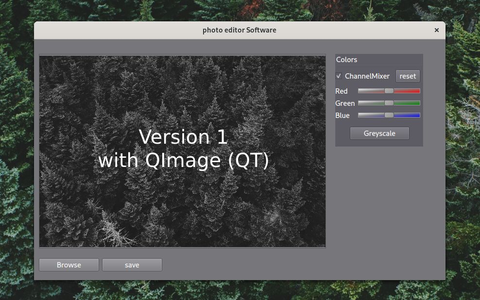

# PhotoEdits
Personal project to create a photo editing software.  
The pure purpose of this project is to learn some new concepts of C++, first steps with QT and to get to know some photo related algorithms.  

State: Base Version(v1) with QImage (QT) done.  

Roadmap:    
- Basic GUI functionality (done)
- Basic color correction  (done)
- Color Key function
- Filter option           (greyscale done)
- file converting (format/size)

 

Next:
v2 with a multi threaded GPU workflow.  
- OpenCL vs OpenGL vs OpenCV
- take a closer look at boost gil
- recreate V1
- complete Roadmap